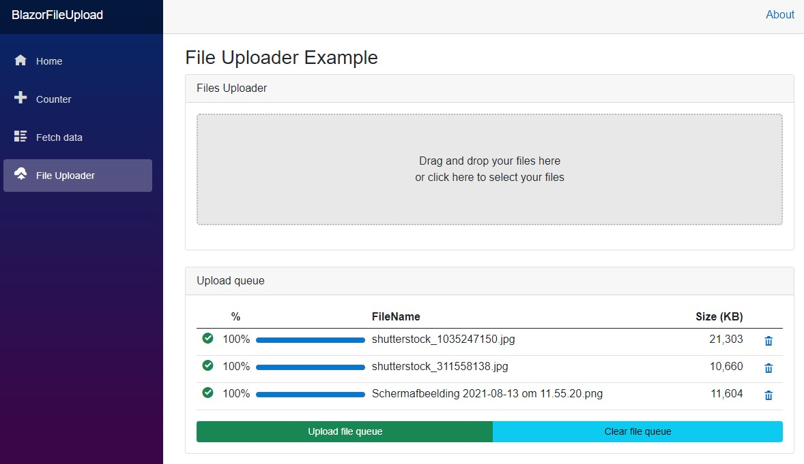

# Blazor 6 client File Upload Demo
A demo to show how to upload files from the client side of Blazor, with individual progress bars for each file.

### Features:
- Multiple file uploader
- **Drag and Drop** functionality.
- Files are **uploaded in chunks**.
- Files are placed into an upload **queue before uploading** for review.
- Files can be individually removed from the queue.
- All queued files can be removed from the queue.
- Each file in the queue has its **own progress bar**.
- Once the file(s) have been uploaded, they stay in the queue and **maked as uploaded**.
- Unique name is created before uploading to the server using `DateTime.Now.Ticks`.

---

